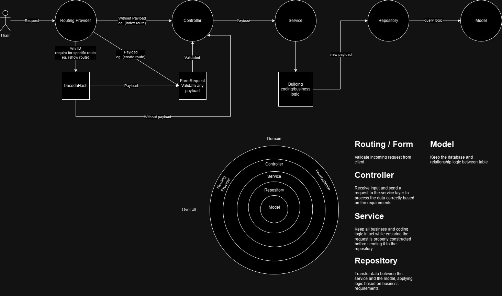
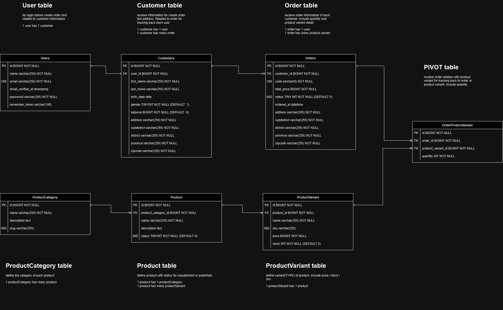

# EZ order-product Laravel


## Framework & Tools used

- Laravel 10
- hashids
- pint

# Development

### Requirement

- PHP 8.1
- MySQL


### Installation (Laragon)

1. Clone project (https://github.com/drivedemon/ez-laravel-products)
2. Create .env file by copy content from .env.example `cp .env.example .env`
3. (Laragon) Restart Laragon
4. (Auto by Laragon) Config custom DNS for your machine ([ez-laravel-products.test](http://ez-laravel-products.test)), Make sure url match
   **APP_URL** in .env
5. Run `composer install`
6. Run `php artisan key:generate` to generate application key
7. Create your Database `laravel-product`, update `DB_USERNAME`, `DB_PASSWORD` in .env
8. Run `php artisan migrate --seed` to migrate and seed database
9. Go to [http://ez-laravel-products.test](http://ez-laravel-products.test) to test your local website. 
10. Create new feature branch to start working.

# Backend Structure

Preview code structure (File name: `app/product-structure-flow.jpg`)


# Database Schema

See in folder: `app/dbStructure`

Including explanation table structure
Preview DB structure (File name: `app/dbStructure/product-erd.jpg`)


# Postman for testing

collection for import to postman app and testing

See in folder: `app/postman`

API required login
- api/codes
- api/orders
- api/orders/{orderId}
- api/balance

NOTE: Please call api login first before testing upper list API
```
after migrate with seeder (in number 8) will be create testing user automatically

email: test@example.com
password: password
```